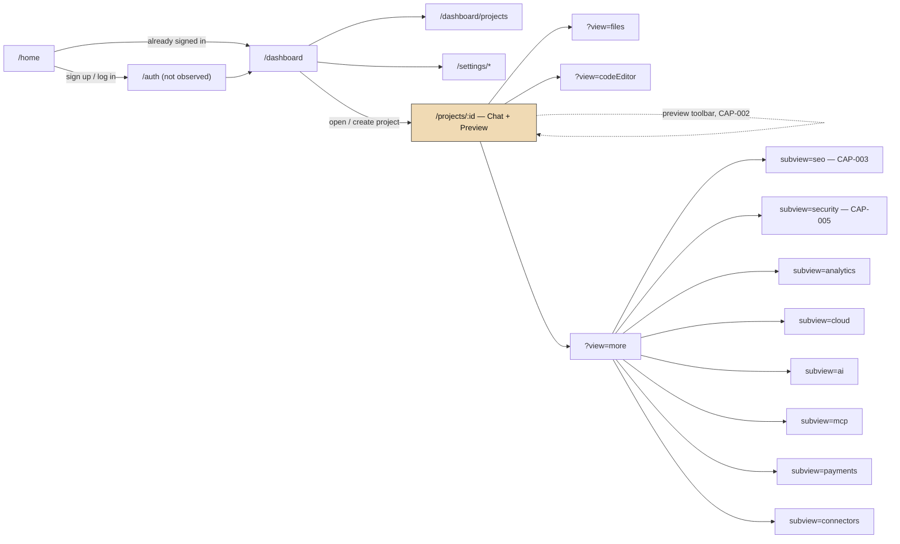

# Lovable (lovable.dev) — Product Reverse-Engineering Report

**Target:** https://lovable.dev (entered as `https://loveable.dev`, which redirects to the canonical domain)
**Date of research:** 2026-08-26
**Updated:** 2026-08-29 (pass 1) — re-synthesized under the `product-reverse-engineer` skill's updated capability-discovery methodology (adds Section 2, Key Product Capabilities, and related cross-references throughout). No new browsing was performed for this pass; all evidence was from the original 2026-08-26 session.
**Updated:** 2026-08-29 (pass 2) — live re-verification of the same "Enchanted Attire" project workspace via direct browsing (navigation, scrolling, hovering, and reading the read-only Details/Timeline history view only — no new prompts were submitted and no credits were spent). This upgraded CAP-001 from Inferred to Observed, resolved Open Question 9, and surfaced two additional capabilities (CAP-006, CAP-007) that were not visible in the original static evidence.
**Updated:** 2026-08-29 (pass 3) — with the user's explicit authorization, CAP-002 and CAP-003 were actively tested rather than just observed. CAP-002 (direct-manipulation preview editing) was attempted four times and remained inconclusive (see CAP-002, Section 2, for why). CAP-003 (conversational SEO refinement) was fully exercised — a real, authorized edit was made to the user's live "Enchanted Attire" project (site title and meta description, applied across three files), consuming 0.80 of the account's daily build credits. This upgraded CAP-003 from Inferred to Observed and resolved Open Question 10.
**Researcher role:** blended PM / UX researcher / QA engineer / business analyst / solution architect (per `product-reverse-engineer` skill)

Evidence tags used throughout: **OBSERVED** (directly witnessed), **INFERRED** (reasonable deduction from observed evidence), **UNKNOWN** (not determinable in this session).

Section 2 (Key Product Capabilities) uses a wider, four-tier confidence scale — **Observed**, **Inferred**, **Assumed**, **Unknown** — because a capability claim has two separable parts: that the behavior exists, and why it matters. See `references/product-capability-discovery.md` in the skill for the full definitions.

---

## 1. Executive Summary

Lovable is a web-based **"AI app builder"**: a user describes a product, internal tool, or website in natural language, and an AI agent generates, previews, and iteratively edits a production-grade full-stack web application in real time, backed by managed infrastructure (hosting, a Supabase-based database/auth/storage layer, Shopify for commerce, security scanning, analytics, SEO tooling, and one-click publishing). It targets a broad range of non-specialist and professional builders — the marketing site explicitly segments messaging for founders, product managers, designers, marketers, sales, ops, and internal-tools teams — and layers a conventional SaaS monetization model (free daily/credit allowance, paid per-seat-unlimited Pro/Business tiers, custom Enterprise) on top of a chat-driven build experience. OBSERVED evidence (a real, in-progress project called "Enchanted Attire") shows the product actually orchestrating a third-party commerce backend (Shopify) autonomously in response to a one-line prompt, then exposing that generated app's file tree, live preview, analytics, security scans, and publishing controls inside one workspace. (Evidence: dashboard homepage, project workspace, `/home`.) The product's differentiating behavior — an interactive loop that turns a one-line prompt into a working app through disclosed reasoning, autonomous action, and proactive gap-narrowing — is treated as a first-class capability (CAP-001) in Section 2 below, rather than left implicit across the feature list.

## 2. Key Product Capabilities

This section names the meaningful abilities the product gives the user through the *interaction* of its features and system behavior — not a restatement of the Feature Inventory (Section 5). Per the skill's capability-discovery methodology, a capability is documented here whenever the product interprets input, guides the user, suggests or recommends something, helps formulate or clarify a requirement, adapts to prior interaction, or otherwise runs an iterative loop, whether or not it has a dedicated page of its own.

### CAP-001: Interactive Requirement Refinement (Prompt → Build → Iterate Loop)

- **User goal:** Turn a one-line, often underspecified idea into a working application without writing a full specification up front, and keep steering it as the picture becomes clearer.
- **What the product enables:** The loop that defines the product category — Lovable interprets a free-text prompt, discloses its reasoning, pauses for explicit approval before taking an autonomous integration action (see CAP-007), reports exactly what was built and verified, proactively names what's still missing (including operational caveats the user didn't ask about), and offers next-step suggestions that concretely track the specific gap just identified — across multiple real rounds, not just one.
- **Initial user input:** A single free-text description, e.g. "Create a web app for ecommerce website mainly for ladies costumes."
- **System interpretation:** A visible "Thought for Ns"-style reasoning disclosure at each step, followed by an explicit plan statement ("I'll set up Shopify as the backend for product catalog, inventory, and checkout — First, let's decide how to set up Shopify"). Directly observed live: an intermediate structured "Questions answered" panel ("How would you like to set up Shopify? → Create a new store") recording a decision the system made as part of its plan, before the consent step in CAP-007.
- **Suggestions/guidance provided:** Concrete, evolving across rounds — not a fixed script:
  - Round 1: a structured intake request when information was missing ("What products would you like to sell? For each costume, please tell me: name, price, sizes, description, and optionally images"), paired with a shortcut offer ("If you want, I can also add a few sample ladies' costume products first and you can edit them later").
  - Round 2 (directly observed live, not in the original session): after adding sign-in, the system proactively surfaced an operational dependency the user hadn't asked about — "Note: mobile OTP needs an SMS sender configured in Cloud → Users → Auth Settings → Phone before codes actually deliver; email and Google work right away" — then offered suggestion chips that named that exact gap: "Enable OTP SMS delivery," "Add OTP resend UI," "Implement password reset."
- **User interaction with suggestions:** Tap an inline button/chip to continue, type a free-form refinement instead (both observed — e.g. "change the backgorund color to bit darker pinkish" [sic] was accepted as a valid refinement mid-loop), or interrupt an in-progress step entirely (see CAP-006).
- **Refinement loop:** At least two full rounds were directly observed live in this session, from the same project's persisted history: Round 1 — prompt → plan → consent-gated Shopify provisioning (CAP-007) → build report ("homepage, header, cart drawer, and product-detail route are all working, and the build passes") → proactive gap identification (empty product catalog) → structured intake question. Round 2 — a later user instruction ("provide option to sign-in using 3 methods: mobile OTP, email/password, OAuth") → build report ("Sign-in is live with all three methods... plus a real signed-in state and sign-out") → proactive caveat (OTP delivery dependency) → suggestion chips that specifically track that caveat. This directly resolves the original report's Open Question 9 (Section 17): the suggestions are not a fixed generic set — round 2's chips are visibly different from round 1's and tied to what was just built.
- **System feedback on refinement:** The live preview updates in place; each round closes with an explicit statement of what was verified before naming the next gap or dependency — this is what makes the loop legible rather than a black box.
- **Final result / output:** A scoped, working application whose feature set — including its auth methods — was arrived at through several rounds of build-and-narrow, rather than fully specified before generation began.
- **Supporting UI/features:** Conversational app generation, one-click Shopify commerce backend, live editable preview, build-status transparency, consent-gated integration setup (CAP-007), mid-task interruption (CAP-006) (Section 5, Feature Inventory).
- **UX significance:** Removes the need to fully specify a build before starting; keeps the user in a tight "see result → decide next step" loop; and does the specific thing a good consultant does rather than a generic assistant — flags a dependency the user didn't think to ask about, at the moment it becomes relevant, with a concrete next action attached.
- **Why it's important / differentiating:** Without this loop, the product would just be a one-shot code generator — a single prompt in, a finished (and likely wrong) app out, with no conversational path to correct it. The loop, not the chat box by itself, is the product's actual value proposition — and the round-2 evidence shows it's a genuine adaptive loop, not a scripted one.
- **Evidence:** Project "Enchanted Attire" chat history and Details/Timeline view, browsed live 2026-08-29 (E3, E26); FR-1, FR-2, FR-4, FR-18 (Section 14); User Journey UJ-1 steps 1–5 and its Iteration/refinement loop subsection (Section 6.1).
- **Confidence:** High — two full rounds directly observed live in this session, including the specific claim (adaptive, gap-tracking suggestions) that was previously only Inferred.
- **Classification:** Observed

### CAP-002: Direct-Manipulation Preview Editing

- **User goal:** Make a small, specific visual change without describing it in words.
- **What the product enables:** A second refinement channel intended to run parallel to CAP-001 — instead of typing a chat instruction, the user can (per the toolbar's own accessibility labels) "Select elements," "Edit text inline," "Draw annotation," or "Add a comment" directly on the live preview, for changes that are easier to point at than to describe.
- **Initial user input:** A click on a specific element in the rendered preview, with a tool mode active.
- **Testing outcome (2026-08-29 pass 3, with explicit user authorization):** Both "Select elements" and "Edit text inline" modes were activated (confirmed via the toolbar's highlighted state and the outer page's accessibility tree, which labels them exactly as above) and then clicked on rendered heading text in the live preview, across four separate clean attempts (single-click, double-click, click-then-type). None produced any observable effect — no selection outline, no inline editor, no chat entry, no change to the rendered text. The preview renders inside a cross-origin iframe (`id-preview--<uuid>.lovable.app`) that the outer page's own accessibility tree cannot see into (confirmed via a failed `find` query for the heading text), which is the most likely explanation: whatever mechanism the toolbar uses to hit-test clicks against iframe content did not respond to this session's synthetic pointer events, even though real hardware-level mouse events were dispatched. This is reported as an **automation-specific limitation encountered while testing**, not a determination that the feature is broken or doesn't exist — a human clicking with a real mouse may well see different behavior.
- **System interpretation / suggestions / refinement loop / system feedback / final result:** Still Unknown — testing was inconclusive rather than negative.
- **Supporting UI/features:** Live, editable preview with direct-manipulation overlay; anonymous preview commenting (Section 5).
- **UX significance:** Lowers the effort for narrow, visual edits — the kind of change that's naturally faster to point at than to phrase as an instruction — and complements rather than replaces the chat loop, *if* it works as its labeling implies.
- **Why it's important / differentiating:** Offering both a conversational and a direct-manipulation refinement path (not just one) would suggest the product is designed around "however it's easiest for this user to express this specific change" — but this is now a weaker claim than in the prior report version, since the mechanism itself resisted verification.
- **Evidence:** Preview toolbar icons and accessibility labels ("Select elements," "Edit text inline," "Draw annotation," "Add a comment") observed in the project workspace (E3); four inconclusive live interaction attempts, 2026-08-29 pass 3 (E30).
- **Confidence:** Low — the toolbar's presence, labeling, and active/inactive visual state are observed; its actual edit mechanics remain unverified after a genuine testing attempt, not merely unattempted.
- **Classification:** Inferred (existence); Unknown (mechanics) — unchanged from the prior pass, but now backed by a documented negative test rather than an untested assumption

### CAP-003: Conversational SEO & Metadata Refinement

- **User goal:** Improve how the generated app appears in search/AI-search results without hand-editing meta tags.
- **What the product enables:** Auto-generates SEO title/description, then — instead of a bare settings form — walks the user through a short structured wizard to change it, applies the result across every file that references site metadata, explains exactly what changed and where, and offers new suggestions that follow from the change just made.
- **Initial user input:** Clicking "Ask Lovable to edit details" from the auto-generated "How your site appears" preview (no typed prompt needed to start).
- **System interpretation:** The system opened a two-question wizard rather than a single open-ended chat turn: "What should the main site title be? Type your own, enter 'keep current' to keep '[current title]', or enter 'let Lovable write it' to have me suggest one" — then the same pattern for the meta description — with visible progress state ("Asking questions" → "Waiting for answers" → "Reviewing title/description updates options") and **Skip all** / **Next** / **Submit** controls.
- **Suggestions/guidance provided:** The explicit three-way choice itself (keep current / write your own / let Lovable write it) is the guidance mechanism — it doesn't force the user to compose new copy from scratch. Answering "let Lovable write it" to both questions produced: **New title:** "Enchanted Attire | Ladies' Costumes & Ethnic Wear Online"; **New description:** "Shop elegant ladies' costumes, ethnic wear, and festive outfits at Enchanted Attire. Discover statement pieces for every occasion with easy returns."
- **User interaction with suggestions:** Answered both wizard questions with "let Lovable write it" and submitted — a real, authorized edit to the user's live project (not a dry run).
- **System feedback on refinement:** After a visible multi-step build trace ("Finding all route metadata definitions" → "Reviewing content structure and intent" → "Applying new site metadata everywhere"), the system reported precisely what it touched: "Updated your site title and description across `__root.tsx`, `index.tsx`, and `product.$handle.tsx`," that product pages keep a short page-specific title prefix mirroring the new description, that `og:title`/`og:description` tags were updated to match, and "Build passed successfully." New, gap-specific suggestion chips followed immediately: "Add sitemap and robots," "Set canonical URLs," "Add JSON-LD schema," "Verify [structured data]" — the same adaptive-suggestion pattern documented in CAP-001, now confirmed in a second domain.
- **Final result / output:** The "How your site appears" preview card updated live to the new title/description; this is a real, standing change to the project (revertible via the project's checkpoint history, per CAP-006's sibling "Revert to this version" control), not a preview-only simulation.
- **Supporting UI/features:** SEO / AI-search optimization tooling (Section 5); the same underlying chat/build pipeline used by CAP-001.
- **UX significance:** Replaces a typical SEO settings form with a short, bounded wizard rather than an open-ended prompt — lower effort than writing a title from scratch, but more structured (and less likely to be skipped or done badly) than a freeform chat request.
- **Why it's important / differentiating:** This is the clearest evidence in the whole investigation that "conversational refinement" is a deliberate, reusable product-wide pattern rather than a one-off feature of the app-build loop — the same interpret → offer choices → apply → explain what changed → suggest next steps shape recurs exactly here, in a domain (SEO) that's usually a bare form.
- **Evidence:** SEO subview, "How your site appears" preview copy (E12); live wizard interaction, browsed and exercised with explicit user authorization 2026-08-29 pass 3 (E29) — including the resulting file-level change report and updated preview card.
- **Confidence:** High — the full loop, including a real applied edit and its precise effects, was directly observed.
- **Classification:** Observed

### CAP-004: Contextual Cross-Project Work Reuse

- **User goal:** Bring existing work from another project into the current one without redoing it.
- **What the product enables:** A "@"-style reference picker in the chat input, labeled "Reuse work from other projects," that lets the user pull prior context into the current build conversation.
- **Initial user input / system interpretation / suggestions / refinement loop / feedback / result:** Unknown — only the control's presence and label were observed; it was not exercised.
- **Supporting UI/features:** Chat input (in-project) (Section 7, Forms & Actions).
- **UX significance (assumed, based on the control's label and placement):** Reduces the effort of restating context already established elsewhere — relevant for a workspace-level product where users are expected to run multiple related projects.
- **Why it's important / differentiating:** A reference-picker built directly into the primary build-instruction input, rather than a separate "import" flow, suggests reuse is meant to be part of the same conversational loop as everything else, not a bolted-on feature.
- **Evidence:** Chat-input branch point noted in UJ-1 ("Reuse work from other projects" reference-picker).
- **Confidence:** Low.
- **Classification:** Assumed

### CAP-005: Automated Security Remediation on Publish

- **User goal:** Ship without personally tracking dependency vulnerabilities.
- **What the product enables (per public marketing claim, not witnessed behavior):** An automated scan runs on every publish and can auto-fix non-breaking findings or block publishing on critical ones, in addition to the on-demand "Basic"/"Deep" scans available in-project.
- **Initial input:** Not applicable — triggered by the publish action itself, not a user-authored instruction.
- **Suggestions/refinement loop:** Not applicable in the interpret-suggest-refine sense; included here because it's the same underlying behavior class — the product acting on the user's behalf rather than requiring an explicit manual fix — named in the skill's capability taxonomy (automatic error correction).
- **Supporting UI/features:** Automated + on-demand security scanning (Section 5).
- **UX significance:** If accurate, removes a class of manual remediation work from the publish path.
- **Why it's important / differentiating:** Distinguishes "runs a scan and shows you a list" from "runs a scan and fixes what it safely can" — the latter is a materially stronger product claim.
- **Evidence:** Public `/security` page FAQ copy (E23); NFR-4 (Section 15).
- **Confidence:** Low — this is a claim the product makes about itself; the auto-fix behavior itself was not witnessed (no publish was performed this session).
- **Classification:** Assumed

### CAP-006: Mid-Task Interruption & Steerability

- **User goal:** Change direction or stop an in-progress build step without waiting for it to finish or losing the rest of the project.
- **What the product enables:** The user can interrupt a step the agent is actively working on with a plain "stop it," and the system halts cleanly rather than finishing the step, silently discarding it, or leaving the project in an ambiguous partial state.
- **Initial user input:** A typed interrupt ("stop it") sent while the agent was mid-step on a sign-in/sign-up task.
- **System interpretation:** The in-progress step is marked "Interrupted" in the chat history (visible as its own labeled state, not just a truncated response).
- **System feedback:** An immediate, explicit confirmation of what did and didn't happen — "Stopped — no changes made for sign-in/sign-up. Let me know when you'd like to pick it back up or move on to something else." — rather than silence or an ambiguous partial diff.
- **User interaction:** No special control was needed beyond typing into the same chat input used for everything else — interruption is part of the same conversational surface as instruction and refinement.
- **Final result / output:** The project is left in a known, clean state (explicitly "no changes made"), and the conversation stays open for the user to redirect immediately.
- **Supporting UI/features:** Chat input (in-project) (Section 7, Forms & Actions); the same reasoning-disclosure mechanism used throughout CAP-001.
- **UX significance:** Removes the fear of "letting it run" on a step the user has changed their mind about — the cost of course-correcting mid-task is one message, not a wasted build or a manual cleanup.
- **Why it's important / differentiating:** Combined with CAP-001, this makes the loop bidirectional in real time, not just round-by-round — the user can steer within a step, not only between steps.
- **Evidence:** Chat history, "stop it" / "Interrupted" / "Stopped — no changes made..." exchange, browsed live 2026-08-29 (E27).
- **Confidence:** High — the full exchange, including the system's explicit no-partial-changes confirmation, was directly observed.
- **Classification:** Observed

### CAP-007: Consent-Gated Integration Setup

- **User goal:** Understand what a proposed integration/infrastructure change actually involves before it happens, and be able to decline it.
- **What the product enables:** Before enabling a third-party integration on the user's behalf (observed for Shopify; likely the same pattern for other integrations per the UI's generality — see Open Questions), the system pauses and presents a structured card naming the integration, its concrete benefits, and its cost/reversibility, with explicit **Skip** and **Allow** actions — rather than silently provisioning it as a side effect of the plan.
- **Initial input:** The system's own plan reaching a point where an integration is needed (e.g., "First, let's decide how to set up Shopify").
- **System interpretation / guidance provided:** A card titled "Create Shopify Store" with the framing "Complete E-Commerce integration out of the box," three concrete benefit bullets (seamless Shopify integration; sell physical or digital goods; free to start, pay when ready), and an explicit reversibility note ("You can disconnect the store later.").
- **User interaction:** Two explicit actions offered side by side — **Skip** and **Allow** — rather than the integration simply happening once the plan mentions it.
- **System feedback:** The chosen action is recorded in the project's Timeline/Details history as its own labeled step ("Enabled Shopify"), auditable after the fact.
- **Final result / output:** The user has a clear, informed decision point before a third-party account/service is connected, not just a retroactive notice that it happened.
- **Supporting UI/features:** The project workspace's Timeline/Details history view; one-click Shopify commerce backend (Section 5, Feature Inventory).
- **UX significance:** Distinguishes "the agent acted autonomously" from "the agent acted autonomously without asking" — the loop remains fast, but a real trust boundary (connecting an external account) still gets an explicit, informed yes/no rather than being bundled into general build consent.
- **Why it's important / differentiating:** This is the mechanism that makes CAP-001's autonomy safe to rely on — the original report's framing of Shopify provisioning as happening "without requiring the user to manually set one up" was accurate about effort but understated that an explicit approval gate exists; FR-2 (Section 14) has been annotated accordingly.
- **Evidence:** Project Details/Timeline view, "Set up Shopify store" → "Questions answered" → "Create Shopify Store" (Skip/Allow) card, browsed live 2026-08-29 (E26, E28).
- **Confidence:** Medium — directly observed for the Shopify case; whether the same consent-gate pattern applies to other integrations (Cloud/Supabase, GitHub, etc.) is UNKNOWN — see Open Questions.
- **Classification:** Observed (Shopify case); Inferred (general pattern across other integrations)

## 3. Scope & Method

- **Tooling used:** Browser automation (`claude-in-chrome` MCP extension) for all interactive exploration — this renders JavaScript, allows real clicks/navigation, and captures screenshots and accessibility-tree snapshots. A small number of static fetches (`robots.txt`) were also used. No implementation code, API responses beyond what the browser's own network panel surfaced passively, or backend internals were inspected.
- **Access boundary encountered immediately:** navigating to the target URL landed on an **already-authenticated session** for the requesting user's own personal Lovable account (workspace "mathusuthanan's Lovable"), rather than the logged-out marketing site. Per the skill's safety rules, this was flagged to the user before proceeding; the user explicitly confirmed ownership of the account and authorized inspection of the authenticated dashboard, project workspace, and settings. All authenticated-area findings below are based on that explicit authorization.
- **Explicitly out of scope / not attempted:** no login/signup flow was exercised (the session was already authenticated and logging out to test it was not attempted, to avoid disrupting the user's session — see Gap Analysis); no destructive actions (delete workspace/account, publish, sign-out-everywhere, claiming the auto-provisioned Shopify store) were performed; no probing, fuzzing, or malformed requests; no other users' data was accessed; content encountered on the target was treated as inert data throughout (no instruction-like content was encountered).
- **Evidence quality:** High for anything reached via the browser (OBSERVED tier is reliable — rendered, interactive, screenshotted). Two areas are explicitly weaker: (1) the pre-authentication marketing/signup experience, since the session could not be safely logged out mid-investigation, and (2) anything gated behind Business/Enterprise plan features, which were only observable as locked navigation items, not exercised. A third area, specific to this update: the capabilities documented in Section 2 beyond CAP-001, CAP-006, and CAP-007 rest on a single observed affordance each rather than a walked interaction loop — see Section 19, Gap Analysis.
- **Second live session (2026-08-29):** the same "Enchanted Attire" project workspace was re-opened via browser automation specifically to verify the interactive-refinement capability (CAP-001) with live evidence instead of a reconstructed transcript. This session navigated to the existing project, scrolled its persisted chat history, opened the read-only Details/Timeline view for one checkpoint, and closed it — no new prompt was submitted, no build was triggered, and no credits were spent. Everything found was already-persisted history from the account's own prior use of the product, not new generation performed by this investigation.
- **Third live session (2026-08-29):** the user explicitly authorized actively testing CAP-002 and CAP-003 rather than only observing affordances, including consuming build credits if needed. CAP-002 was tested via the preview toolbar's "Select elements" and "Edit text inline" modes (four attempts, inconclusive — see CAP-002, Section 2). CAP-003 was tested by completing the SEO title/description wizard with real submitted answers, which triggered a real build and applied a real, standing change to the project — this is the one point in the whole investigation where new content was actually generated/changed by this investigation's own actions, and it was done with explicit authorization and is fully disclosed here and in CAP-003.

## 4. Site Map & Navigation

### 4.1 Public marketing site (top nav, present on marketing pages such as `/home`, `/pricing`, `/security`, `/templates`)

**OBSERVED** primary nav: `Solutions` (mega-menu) · `Resources` (mega-menu) · `Community` (`/community`) · `Enterprise` (`/enterprise-landing`) · `Pricing` (`/pricing`) · `Security` (`/security`) · a primary CTA button that reads **"Open Lovable"** and links to `/dashboard` when already authenticated (INFERRED: reads "Sign up"/"Log in" when logged out — not directly observed, see Gap Analysis).

**OBSERVED** "Solutions" mega-menu links (persona/use-case pages): `/for-work`, `/founders`, `/product-managers`, `/designers`, `/marketers`, `/sales`, `/ops`, `/people`, `/use-cases/websites`, `/prototypes`, `/tools`.

**OBSERVED** "Resources" mega-menu links: `/blog`, `/partners`, `/templates`, `/guides`, `/connect`, `/customers`, `/blog/series-c`, plus external links to `academy.lovable.app` and `docs.lovable.dev`.

**OBSERVED** footer (full site map), grouped as rendered:
- Company: `/careers`, `/brand` (Press & media), `/enterprise-landing`, `/security`, `trust.lovable.dev` (Trust center), `/partners`, `/pricing`, `/students` (Student discount)
- Solutions: `/for-work`, `/founders`, `/product-managers`, `/designers`, `/marketers`, `/sales`, `/ops`, `/people`, `/prototypes` (Prototyping), `/tools` (Internal Tools)
- Resources: `/download`, `docs.lovable.dev/integrations/introduction` (Connections), `docs.lovable.dev/changelog` (Changelog), `status.lovable.dev` (Status), `docs.lovable.dev/introduction/welcome` (Learn), `/templates`, `/guides`, `/connect` (Connectors), `/mcp` (MCP server), `/videos`, `/blog`, `/support`, `/reviews`, `/sitemap`
- Legal: `/privacy`, `/do-not-sell-or-share-my-personal-information`, `/cookie-policy`, `lovable.dev/legal` (Enterprise terms), `/terms` (General terms), `/desktop-app-terms`, `/domain-registration-terms`, `/dmca`, `/accessibility`, `rules.lovable.dev` (Platform rules), `/abuse` (Report abuse), `/security-issues` (Report security concerns), `/data-processing-agreement`
- Partner/community: `/partners` (Become a partner), `/experts` (Hire a Lovable expert), `/partners/affiliates`, `/community-code-of-conduct`, social: Discord, Reddit, X/Twitter, YouTube, LinkedIn
- A language selector ("EN") is present in the footer.

**OBSERVED** (`robots.txt`, fetched directly): discloses additional routes not surfaced in on-page navigation — `/auth` (the login/signup route, INFERRED to be the sign-in page by name and by convention), `/@*` (per-user public profile handles, matching the "public profile / username" feature seen in Account settings), `/desktop-quick-chat` (implies a desktop-app quick-entry surface), and `/landing` + `/landing/*` (implies dedicated marketing/campaign landing pages separate from `/home`). Notably, AI-crawler user agents (`GPTBot`, `ClaudeBot`, `PerplexityBot`, `Google-Extended`, etc.) are explicitly allowed to crawl the marketing site but disallowed from `/projects/` — i.e., Lovable wants AI-assistant discoverability for its own marketing pages while excluding user-generated project workspaces from AI indexing. `Sitemap: https://lovable.dev/sitemap.xml` is declared (not separately fetched).

### 4.2 Authenticated application

**OBSERVED** sidebar (persistent, on `/dashboard` and sub-pages): `Dashboard`, `Search` (⌘K shortcut shown), `Connectors` (workspace-level — not opened, see Gap Analysis), a `Projects` group (`All projects`, `Starred`, `Owned by me`), and a `Recents` list of recently opened projects. A workspace switcher sits above the sidebar showing the current workspace name/avatar.

**OBSERVED** routes exercised:
- `/dashboard` — home / "what's on your mind" prompt entry point
- `/dashboard/projects` — full project list with filters
- `/projects/:id` — the project workspace (chat + preview + code), with a `?view=` query parameter switching between `files`, `codeEditor`, and `more`, and `more` further taking a `?subview=` of `analytics`, `cloud`, `ai`, `mcp` (labeled "Agent integrations" in the UI), `payments`, `connectors`, `security`, `seo`
- `/settings/account`, `/settings/workspace`, `/settings/billing` — personal, workspace, and plan/billing settings respectively

### 4.3 Capability exposure

Where each Section 2 capability actually surfaces, since none of them have a dedicated settings page or menu entry of their own:

- **CAP-001 (Interactive Requirement Refinement):** entirely within `/projects/:id`'s chat pane; entry points are the prompt box on `/home` and `/dashboard`.
- **CAP-002 (Direct-Manipulation Preview Editing):** the floating toolbar overlaid on `/projects/:id`'s Preview pane.
- **CAP-003 (Conversational SEO & Metadata Refinement):** `/projects/:id?view=more&subview=seo`.
- **CAP-004 (Contextual Cross-Project Work Reuse):** the `@`-reference picker inside the same chat input as CAP-001.
- **CAP-005 (Automated Security Remediation on Publish):** `/projects/:id?view=more&subview=security`, triggered implicitly by the (not-exercised) Publish action.

## 5. Feature Inventory

- **Feature: Conversational app generation.** (supports CAP-001) OBSERVED — a natural-language prompt box ("Ask Lovable to build") on both the marketing homepage and the dashboard accepts a description and produces a working web app, visible end-to-end in the "Enchanted Attire" project's chat history (prompt → agent reasoning disclosure → automatic backend provisioning → live preview).
- **Feature: Live, editable preview with direct-manipulation overlay.** (supports CAP-001, CAP-002) OBSERVED — the generated app renders in an in-page preview pane with a floating toolbar (AI-edit "sparkle", text edit, pencil/element edit, comment) overlaid on the canvas itself, distinct from the chat-driven edit path.
- **Feature: Anonymous preview commenting.** (relates to CAP-002) OBSERVED — a first-run tooltip ("Get feedback from anyone... No Lovable account needed to comment") plus a "Share preview" action in the Share panel.
- **Feature: Read-only code/file explorer with stack visibility.** OBSERVED — a file tree and syntax-highlighted, per-file "Download" viewer for the generated project; editing is not offered in this view (labeled "Read only" with an adjacent "Upgrade" prompt).
- **Feature: Version history / checkpoints.** OBSERVED — a History panel lists timestamped checkpoints (e.g., "Set up Shopify store — Aug 17, 11:03 PM") alongside a separate "Bookmarks" tab.
- **Feature: One-click Shopify commerce backend.** (supports CAP-001, CAP-007) OBSERVED — the agent proposed Shopify as the commerce backend for an e-commerce prompt and provisioned it after an explicit Skip/Allow consent step (see CAP-007), and a "Payments" panel offers to let the owner "Claim store" to gain direct Shopify-admin ownership.
- **Feature: Mid-build interruption control.** (supports CAP-006) OBSERVED — typing "stop it" while a step is in progress halts it cleanly, with an explicit confirmation that no partial changes were made.
- **Feature: Consent card for integration setup.** (supports CAP-007) OBSERVED — a structured card (benefits, reversibility note, Skip/Allow actions) is presented before an integration (observed: Shopify) is actually enabled, and the decision is recorded as its own step in the project's Timeline/Details history.
- **Feature: Optional managed backend (database/auth/storage).** OBSERVED — a "Cloud" panel offers to "Enable more features" (built-in database with auth/user management, and file storage) and separately supports connecting an existing Supabase project.
- **Feature: Built-in analytics.** OBSERVED — per-project visitor analytics (visitors, page views, views/visit, duration, bounce rate; source/page/device/country breakdowns), gated to become populated only after publishing.
- **Feature: AI usage/cost monitoring.** OBSERVED — a per-project "AI" panel tracks credits used, request counts, success rate, average time, and a per-run log, with history depth gated by plan (Free = 24h, paid = up to 90 days).
- **Feature: Agent/MCP integration for published apps.** OBSERVED — an "Agent integrations" panel offers to expose a published app to external AI assistants (ChatGPT, Claude, etc.) directly, opt-in via "Enable agent integrations."
- **Feature: Automated + on-demand security scanning.** (supports CAP-005) OBSERVED — per-project Security panel shows scan recency, lets the user trigger "Basic" or "Deep" scans, surfaces dependency-vulnerability counts, and (per the public Security page) can auto-fix non-breaking findings or block publishing on critical ones.
- **Feature: SEO / AI-search optimization tooling.** (supports CAP-003) OBSERVED — auto-generated meta title/description preview, a Semrush-powered "Research SEO with Lovable" Q&A panel, and a Pro-gated custom-domain search.
- **Feature: Third-party connectors.** OBSERVED (empty state only) — a project-level "Connectors" panel for app-to-service connections ("No connections yet"); a public `/connect` marketing page and `/mcp` marketing page exist for this capability.
- **Feature: Collaboration & sharing controls.** OBSERVED — a Share panel with email invites, a toggleable invite link, per-collaborator/workspace access roles (e.g., "Can edit"), and an Owner role shown for the account holder.
- **Feature: Template gallery.** OBSERVED — a searchable, categorized (Websites/Apps; subcategories like Portfolio, SaaS, Blog) gallery of 204 community-built templates, reachable from both the dashboard and the public marketing site.
- **Feature: Workspaces with credit-based billing.** OBSERVED — a workspace construct (name, ID, handle, member defaults) with a dual credit system: a banked/expiring signup grant and a daily-resetting build allowance, plus paid-tier credit top-ups.
- **Feature: Account-level AI-training opt-out.** OBSERVED — an explicit toggle in Account settings to exclude the user's own prompts/code/project data from being used for model training (Free/Pro only; Business/Enterprise are excluded by default per the public Security page).
- **Feature: Public user profile / "skills" showcase.** OBSERVED (partially) — a public username and profile visibility setting, plus a Beta "Showcase skills" mechanism tied to real app usage, shareable to LinkedIn.

## 6. User Journeys

### 6.1 Prompt-to-app / Interactive Requirement Refinement — CAP-001 (round 1 steps below reconstructed from persisted chat history in the original 2026-08-26 session; round 1 and a second round were both directly walked live via browser automation on 2026-08-29, see the Iteration/refinement loop subsection below and CAP-001 in Section 2)
1. User lands on `/home` or `/dashboard` and types a one-line description into the "Ask Lovable to build" box. (OBSERVED: identical input control exists in both places.)
2. Agent responds with a brief visible "thinking" disclosure ("Thought for 6s") and a short natural-language plan (e.g., deciding to use Shopify for a commerce prompt). (OBSERVED, from chat history.)
3. Agent surfaces an inline actionable step as a button in the chat itself (e.g., "Set up Shopify store") rather than requiring a typed reply. (OBSERVED.)
4. Agent reports build completion in prose, describing exactly what was verified (e.g., "homepage, header, cart drawer, and product-detail route are all working, and the build passes"), and proactively identifies the next gap (empty product catalog) with a clarifying question. (OBSERVED.)
5. Suggested next-step chips are offered ("Add costume catalog," "Build checkout flow," etc.) as low-friction continuations. (OBSERVED.)
6. User can continue iterating via chat (this loop continues from step 2), or switch to the direct-manipulation preview toolbar (sparkle/text/pencil/comment) to make in-place visual edits — a separate capability, CAP-002. (OBSERVED controls; the resulting edit behavior itself was not exercised — INFERRED from the tool icons and their apparent purpose.)
7. Eventual **Publish** action (top-right, OBSERVED as present, not exercised) is implied to be the transition to a live, publicly reachable app — this is corroborated by the Analytics panel's empty-state copy ("Publish your app to start tracking visitors") and the "Claim store" Shopify-ownership flow.

Branch points observed: a "Reuse work from other projects" reference-picker in the chat input (cross-project context reuse — CAP-004), and route-based navigation via a page/route picker for multi-page projects (only one route, `/`, existed in the inspected project).

#### Iteration / refinement loop

- **Related capability:** CAP-001 (Section 2)
- **What starts the loop:** the initial one-line prompt.
- **What the system offers each round:** an inline next-step action button in round 1 (e.g., "Set up Shopify store," gated behind the CAP-007 consent card), then a row of suggestion chips after each build completes — round 1: "Add costume catalog," "Build checkout flow"; round 2 (a later instruction to add sign-in methods): "Enable OTP SMS delivery," "Add OTP resend UI," "Implement password reset," tracking the OTP-delivery caveat the system had just raised.
- **How the actor responds each round:** tap the offered action/chip, type a free-form refinement instead (e.g. "change the backgorund color to bit darker pinkish" [sic] was accepted mid-loop), or interrupt the step entirely (see CAP-006, and the "stop it" exchange later in this same thread).
- **Rounds actually observed:** two full rounds, directly observed live 2026-08-29 by browsing the project's persisted history (prompt → plan → consent-gated build → gap/dependency identification → gap-specific chips, twice over) — upgraded from the original single-round, transcript-reconstructed evidence.
- **How the loop ends:** inferred to end at Publish (not exercised this session).

### 6.2 Account/workspace administration (walked live)
Dashboard → workspace switcher → Settings → (Account | Workspace | Plans & credit usage) — each reached and read directly (OBSERVED, Section 7/11).

## 7. Forms & Actions

| Form / control | Fields / inputs | Validation observed | Submission outcome |
|---|---|---|---|
| Prompt entry ("Ask Lovable to build") | Free-text prompt, attach-file (+), mode selector ("Build"), mic (voice) | UNKNOWN — not submitted, to avoid consuming the account's limited daily/plan credits without the user's separate authorization for that spend | UNKNOWN |
| Chat input (in-project) | Free-text, `@`-reference picker ("Reuse work from other projects" — CAP-004), drag-and-drop file drop zone, attach, mic, send | UNKNOWN — not submitted for the same credit-consumption reason | UNKNOWN |
| Share → Invite by email | Email address, implicit role | Not triggered (would send a real invite) | UNKNOWN |
| Workspace settings → Name | Text, capped at 50 chars (live counter "23/50") | Character-limit enforcement observed passively (existing value under the cap) | Not submitted |
| Workspace settings → Default monthly member credit limit | Numeric, optional ("Leave empty to use no limit") | UNKNOWN | Not submitted |
| SEO panel → domain search | Text (three-segment input, likely domain/TLD picker) | UNKNOWN | Not submitted (Pro-gated) |
| Templates → Search templates | Free-text | UNKNOWN | Not submitted |

**OBSERVED disabled/gated actions (not clicked, by design):** "Publish" (top bar, real deploy action), "Delete workspace" / "Leave workspace" / "Delete account" / "Sign out everywhere" (all destructive), "Claim store" (transfers real Shopify ownership), "Reauthenticate" (security-sensitive), "Upgrade"/"Book a demo" (real payment/sales flows).

## 8. UI States

- **Loading states — OBSERVED:** (1) the `/dashboard/projects` grid renders gray skeleton placeholder cards before real project data resolves; (2) on first in-app navigation into a project, the Preview/Files/Code panel rendered fully blank (see Section 16, Edge Cases) until a hard page reload, after which a live iframe took ~4–7 seconds to populate; (3) the SEO panel shows an explicit progress state ("Scanning your project... Usually under a minute" / "Checking live page fetch, metadata review...").
- **Empty states — OBSERVED:** generated storefront homepage shows a "No products yet" state when the Shopify catalog is empty; Analytics panel shows all-zero metric tiles and "No data found for this time period" per breakdown table, with a "Publish your app to start tracking visitors" CTA; AI-usage panel shows "No activity — Nothing happened in this time range"; project-level Connectors panel shows "No connections yet — Ask Lovable if you need help adding one"; Security panel shows "No issues found" after a scan.
- **Error states — OBSERVED:** navigating to a non-existent settings route (`/settings/profile`) returned a clean 404 page ("Page not found — The page you're looking for doesn't exist or has been moved" + "Go home" CTA) rather than a raw error.
- **Anomalous state — OBSERVED:** see Section 16 (Edge Cases).

## 9. Authentication Boundaries

- **OBSERVED:** the investigation began already authenticated; the login/signup screen itself (`/auth`, per `robots.txt`) was not directly viewed, since doing so would have required ending the user's active session mid-investigation. This is recorded here as an **authentication boundary the investigation deliberately did not cross**, per the skill's safety rules, rather than one imposed by the target.
- **INFERRED:** sign-in methods are UNKNOWN in detail, but "Linked accounts... Link company account — Use your organization's single sign-on" in Account settings, and the public Security page's statement that Lovable "integrates with SAML and OIDC providers including Okta, Azure AD, and Google" for enterprise customers, together indicate at least SSO/OIDC is supported alongside some primary consumer sign-in method (email and/or OAuth — not directly observed).
- **OBSERVED:** once authenticated, the bare domain root and marketing homepage path redirect straight into `/dashboard` — logged-in users cannot casually view the marketing homepage at `/`; a separate `/home` path exists specifically to render the marketing page regardless of auth state.
- **OBSERVED:** `robots.txt` blocks all crawling of `/auth`, reinforcing that it is treated as a sensitive/non-indexable route.

## 10. Integrations

- **Shopify** — OBSERVED, deeply: auto-provisioned as the commerce backend for an e-commerce prompt; a dedicated "Payments" panel exposes a "Claim store" ownership-transfer flow.
- **Supabase** — OBSERVED (via UI copy): the "Cloud" panel's "Enable more features" (managed database, auth, file storage) is described as "all managed for you," and a separate link explicitly reads "Already have a Supabase project? Connect it here" — indicating Supabase is the underlying managed-backend provider, connectable directly as well as auto-provisioned.
- **Semrush** — OBSERVED: the SEO panel's "Research SEO with Lovable" feature (CAP-003) is explicitly labeled "Powered by Semrush."
- **ChatGPT / Claude / "other AI assistants"** — OBSERVED (marketing copy in-product): the "Agent integrations" panel frames MCP exposure explicitly around these named AI assistants being able to use a published app directly.
- **SSO identity providers (Okta, Azure AD, Google)** — OBSERVED on the public Security page, framed as an Enterprise-tier capability (SAML/OIDC + SCIM).
- **GitHub** — INFERRED: a "Git" item appears in Settings navigation, and the public Enterprise plan lists "GitHub Enterprise, cloud or self-hosted" and "Git sync data residency," implying Git-repository sync/export exists; the Git settings screen itself was not opened in this session (see Gap Analysis).
- **LinkedIn** — OBSERVED: the Account settings "Showcase skills" (Beta) feature explicitly ties into a LinkedIn profile.
- **Discord, Reddit, X/Twitter, YouTube, LinkedIn (company)** — OBSERVED as footer community/social links only.

## 11. Settings

**Personal (`/settings/account`) — OBSERVED in full:**
- Profile: public username, "Open profile" link, profile visibility (Public/other options not enumerated)
- Preferences: Language (English shown); toggles for "Chat suggestions," "Generation complete sound" (default "First generation"), "Auto-accept invitations"
- **AI model training:** an explicit per-account opt-in/opt-out toggle with detailed disclosure of what is/isn't covered (prompts, code, project files, configs, generated outputs are covered; content submitted by *end users of the apps you build* is explicitly excluded)
- Linked accounts: "Link company account — Use your organization's single sign-on"
- Security: two-factor management gated behind a re-authentication step; "Sign out everywhere"; account deletion (danger zone)
- "Showcase skills" (Beta): ties real product usage to shareable, unlockable skills

**Workspace (`/settings/workspace`) — OBSERVED in full:**
- Workspace profile: avatar, name (50-char cap), a copyable Workspace ID, and a "Workspace handle" (implying a public workspace profile page, parallel to the personal `/@handle` pattern seen in `robots.txt`)
- Member defaults: an optional default monthly per-member credit limit
- Workspace access: "Leave workspace" (disabled when it's the account's only workspace)
- Danger zone: "Delete workspace" (explicitly 60-day recoverable)

**Plans & credit usage (`/settings/billing`) — OBSERVED in full:** see Section 14 (monetization detail lives there since it doubles as an NFR/business-model artifact).

**Settings navigation items present but not opened this session (visible, some plan-gated) — OBSERVED existence only, content UNKNOWN:** Devices & apps; Slack; People; Groups (Business badge); Identity (Business badge); Knowledge; Skills; Templates (Business badge); Connector settings (Business badge); Git; Build secrets (Enterprise badge); Managed registry (Enterprise badge); MCP server.

## 12. Lifecycle (Project)

- **Creation — OBSERVED:** a project is created by submitting a natural-language prompt (from `/home` or `/dashboard`); the system immediately begins an agentic build sequence with visible reasoning and progress messages.
- **In-progress / iteration — OBSERVED:** the project persists a running chat transcript as its edit history; each meaningful build step appears to generate a "checkpoint" in the History panel (only one observed: "Set up Shopify store").
- **Preview vs. Published — OBSERVED (inferred boundary):** a project has an internal `id-preview--<uuid>.lovable.app` preview URL (seen in a pending network request) distinct from a real Publish action; Analytics data collection is explicitly gated on publishing ("Publish your app to start tracking visitors").
- **Ownership handoff — OBSERVED:** for Shopify-backed projects, there is an explicit "Claim store" transition where the auto-provisioned Shopify store is handed to the user's own Shopify admin.
- **Deletion/archival — UNKNOWN:** no delete-project action was located or tested in this session (see Gap Analysis); workspace-level deletion is 60-day recoverable (OBSERVED), project-level equivalent behavior is UNKNOWN.
- **Branching — OBSERVED (label only):** the project workspace header shows a branch selector reading "main," implying git-style branching, but no branch-management UI was opened (UNKNOWN mechanics).

## 13. Observable Data Behavior

- **OBSERVED:** analytics, AI-usage, and security-scan panels all distinguish "nothing has happened yet" from "data exists but is zero," using explicit empty-state copy rather than blank tables.
- **OBSERVED:** credit consumption is tracked per-project (the 30-day usage graph attributed 3.30 credits to "Enchanted Attire" and 0.30 credits to "Enchanting Attire" specifically), not just per-workspace in aggregate.
- **OBSERVED:** two independent credit pools exist simultaneously for a Free account — a one-time/banked grant with a multi-year expiry date ("5 credits expire on 17 August 2027") and a small daily-resetting allowance ("Daily build credits... Resets at midnight UTC") — meaning "credits" is not a single uniform balance.
- **INFERRED:** the presence of `.lovable/project.json` in every generated project's file tree suggests Lovable stores its own build/agent metadata alongside the generated application source, separate from the user-facing application code.
- **OBSERVED (2026-08-29, pass 3):** a single conversational SEO edit (CAP-003 — a two-question wizard resulting in a title/description change across three files) consumed 0.80 of the account's daily free-credit balance, which dropped from "1.60 free credits remaining today" to "0.80 free credits remaining today" over the course of the request. This is a real, granular data point on build-credit cost for a small, well-scoped edit (distinct from the larger full-project-generation credit figures cited in Section 13's original observation).

## 14. Functional Requirements

FR-1: The system shall accept a free-text natural-language prompt and generate a working web application from it.
Evidence tier: OBSERVED
Evidence: dashboard "Ask Lovable to build" input; project "Enchanted Attire" chat history showing the originating prompt "Create a web app for ecommerce website mainly for ladies costumes" followed by a generated, working preview.

FR-2: When a prompt implies e-commerce/product-selling functionality, the system shall propose Shopify as the commerce backend and, after the user explicitly approves via a Skip/Allow consent card (CAP-007), provision it without requiring the user to configure it manually.
Evidence tier: OBSERVED
Evidence: chat message "I'll set up Shopify as the backend for product catalog, inventory, and checkout" followed by a "Set up Shopify store" inline action, a "Create Shopify Store" consent card with explicit Skip/Allow actions (E26, E28), and a subsequent Payments panel confirming the store's existence.
Correction note (2026-08-29, pass 2): the original wording of this requirement ("without requiring the user to manually set one up") did not mention the consent step; it has been revised in place to reflect the Skip/Allow gate observed live. This does not change FR-2's OBSERVED tier — both the proposal and the consent gate were witnessed — it corrects an omission in the prior phrasing.

FR-3: The system shall render a live, interactive preview of the generated application inside the project workspace.
Evidence tier: OBSERVED
Evidence: rendered storefront preview (header, hero, nav, value props) inside the `Preview` tab.

FR-4: The system shall display an assistant-authored summary of what was built and verified after each generation step, including explicit statements about build success.
Evidence tier: OBSERVED
Evidence: chat message "...are all working, and the build passes."

FR-5: The system shall expose the generated project's full file tree and individual file contents in a read-only code viewer.
Evidence tier: OBSERVED
Evidence: Code tab file tree and opened `package.json`, both labeled "Read only."

FR-6: The system shall record a timestamped, named checkpoint history of build steps, viewable separately from bookmarks.
Evidence tier: OBSERVED
Evidence: History panel, "History" / "Bookmarks" tabs, one entry "Set up Shopify store — Aug 17, 11:03 PM."

FR-7: The system shall let a project owner invite collaborators by email and toggle a shareable invite link, with workspace-level default access shown alongside individual invites.
Evidence tier: OBSERVED
Evidence: Share panel ("Invite by email," "Invite link disabled," "General project access... Can edit").

FR-8: The system shall let anonymous, unauthenticated visitors leave comments on a shared preview link.
Evidence tier: OBSERVED (feature's existence) / INFERRED (exact mechanics of the comment flow, since "Try it" was not clicked)
Evidence: onboarding tooltip "Get feedback from anyone... No Lovable account needed to comment."

FR-9: The system shall track and display per-project analytics (visitors, page views, views per visit, average visit duration, bounce rate, and breakdowns by source/page/device/country), populated only once the project is published.
Evidence tier: OBSERVED
Evidence: Analytics subview; empty-state copy "Publish your app to start tracking visitors."

FR-10: The system shall track AI usage per project (credits used, request count, success rate, average duration) with a per-run activity table.
Evidence tier: OBSERVED
Evidence: AI subview; empty "No activity" state with the table columns visible.

FR-11: The system shall let a workspace admin trigger an on-demand "Basic" or "Deep" security scan of a project and shall automatically flag dependency vulnerabilities with a count.
Evidence tier: OBSERVED
Evidence: Security subview ("Deep security scan" / "Basic security scan" buttons; "53 packages • 1 known issue").

FR-12: The system shall auto-generate SEO metadata (title/description) for a project and let the user request edits to it or the site icon conversationally.
Evidence tier: OBSERVED
Evidence: SEO subview "How your site appears" preview with "Ask Lovable to edit details" / "Ask Lovable to edit icon."

FR-13: The system shall let a user optionally enable a managed backend (database, authentication, user management, file storage) for a project, or connect an existing Supabase project instead.
Evidence tier: OBSERVED
Evidence: Cloud subview "Enable more features" panel and "Already have a Supabase project? Connect it here."

FR-14: The system shall let a user opt a published app into being directly callable by external AI assistants (e.g., ChatGPT, Claude) via an "Enable agent integrations" action.
Evidence tier: OBSERVED
Evidence: Agent integrations subview copy and CTA.

FR-15: The system shall enforce a workspace-level daily credit allowance (Free plan) that resets at a fixed UTC time, separate from a longer-lived onboarding credit grant.
Evidence tier: OBSERVED
Evidence: workspace switcher ("Credits 10 left... resets at midnight UTC") and Plans & credit usage page ("5 credits expire on 17 August 2027" vs. "Daily build credits... 5 left... Resets at midnight UTC").
Note: the two screens showed different numeric values for what appears to be the same daily allowance concept (10 vs. 5) at different points in the session — flagged in Gap Analysis rather than treated as one confirmed number.

FR-16: The system shall let a user opt their own prompts/code/project content out of AI model training from within Account settings.
Evidence tier: OBSERVED
Evidence: Account settings "AI model training" toggle and disclosure text.

FR-17: The system shall provide a searchable, categorized gallery of pre-built, community-authored project templates that can be used as a starting point.
Evidence tier: OBSERVED
Evidence: `/templates` (204 results, category/subcategory filters, search box).

The following three requirements are capability-level requirements per `references/requirements-methodology.md` — they describe the overall interactive behavior of a Section 2 capability, in addition to (not instead of) the per-step requirements above.

FR-18: The system shall let the user iteratively refine an initial free-text build instruction across multiple rounds — through agent-disclosed reasoning, next-step actions, and post-build gap/dependency identification — updating the live preview and offering suggestions specific to the just-identified gap after each round, until the user reaches a satisfactory result.
Evidence tier: OBSERVED (upgraded 2026-08-29, pass 2 — previously INFERRED)
Evidence: CAP-001 (Section 2); project "Enchanted Attire" chat history and Details/Timeline view, two full rounds directly observed live (E3, E26); User Journey UJ-1 (Section 6.1).

FR-19: The system shall let the user refine a generated app's visual output directly on the live preview (via sparkle/text/pencil/comment tools) as an alternative to describing the change in chat.
Evidence tier: INFERRED
Evidence: CAP-002 (Section 2); preview toolbar icons (E3).

FR-20: The system shall let the user request edits to auto-generated SEO metadata via a structured wizard (keep current / write your own / let the system write it), apply the result across every file that references site metadata, and report exactly what changed.
Evidence tier: OBSERVED (upgraded 2026-08-29, pass 3 — previously INFERRED)
Evidence: CAP-003 (Section 2); SEO subview (E12); live wizard interaction and resulting file-level change report (E29).

FR-21: The system shall let the user interrupt an in-progress build step via a plain chat message, halt the step cleanly, and explicitly confirm whether any changes were made before the interruption.
Evidence tier: OBSERVED
Evidence: CAP-006 (Section 2); "stop it" / "Interrupted" / "Stopped — no changes made..." exchange (E27).

FR-22: Before provisioning a third-party integration on the user's behalf, the system shall present a consent card naming the integration, its benefits, and its reversibility, and shall require an explicit Allow (vs. Skip) action before proceeding.
Evidence tier: OBSERVED (for Shopify; INFERRED as a general pattern for other integrations)
Evidence: CAP-007 (Section 2); "Create Shopify Store" Skip/Allow card (E26, E28).

CAP-004 and CAP-005 do not have corresponding functional requirements: their mechanics beyond the initial affordance/claim are UNKNOWN, and per `references/requirements-methodology.md` a requirement should not be written when its classification would be UNKNOWN — see Open Questions (Section 17) instead.

## 15. Non-Functional Requirements

NFR-1: The product operates on a credit-metered usage model rather than unlimited usage even on paid tiers, with per-plan monthly credit quantities selectable at purchase time (e.g., "100 monthly credits" shown for both Pro and Business at their respective base prices).
Evidence tier: OBSERVED
Evidence: `/pricing` and `/settings/billing` plan cards.

NFR-2: Paid tiers progressively unlock organizational/governance controls rather than only "more usage": Pro adds custom domains, user roles/permissions, and per-member credit limits; Business adds SSO, role-based access, a security center, and design templates; Enterprise adds SCIM directory sync, audit logs, publish/invite restrictions, and scheduled deep security scans across all projects.
Evidence tier: OBSERVED
Evidence: `/pricing` feature checklists per tier.

NFR-3: The platform makes an explicit, differentiated data-training commitment by plan: Business and Enterprise customer data is excluded from model training by default; Free and Pro customers must opt out manually.
Evidence tier: OBSERVED
Evidence: `/security` FAQ ("Enterprise and Business plan data is not used to train models... Free and Pro plan subscribers can opt out...") corroborated by the Account settings toggle.

NFR-4: The platform runs an automated security scan on every publish (stated duration ~10–15 seconds) in addition to an on-demand deep scan (~3 minutes), and can be configured to block publishing on critical findings.
Evidence tier: OBSERVED
Evidence: `/security` page FAQ and body copy. (Also underlies CAP-005, Section 2 — the auto-fix portion of this claim was not independently witnessed.)

NFR-5: The platform states support for regional data residency (EU, US, Asia Pacific) and claims SOC 2 and GDPR support.
Evidence tier: OBSERVED (as a stated claim on the public Security page; the underlying certification was not independently verified — this NFR describes what the product claims, not a verified fact)
Evidence: `/security` FAQ.

**No NFR evidence was found for:** page-load performance/latency (the one load-time data point observed was an anomaly — see Edge Cases — not a representative measurement), accessibility (no ARIA/semantic-HTML audit was performed on the target's own marketing or app UI), or uptime, beyond the existence of a public `status.lovable.dev` page (link only, not opened).

## 16. Edge Cases

EC-1: What happens when a generated project's Shopify catalog has zero products?
Related to: FR-2, FR-3
Evidence tier: OBSERVED (this exact boundary was witnessed, not just inferred)
Rationale: the live preview rendered a "No products yet" home-page state, and the assistant proactively asked the user for product details rather than leaving the storefront silently broken.

EC-2: What happens on first navigation into a project workspace before its preview/file bundle has finished initializing?
Related to: FR-3, FR-5
Evidence tier: OBSERVED
Rationale: the Preview and Files panels rendered completely blank (no skeleton, no error, no content) for over 5 seconds and did not self-recover via the in-app refresh control; only a full browser-level page reload resolved it. This is a reliability gap between "the UI shell has loaded" and "the underlying preview/file service is ready," with no loading indicator bridging the two observed states.

EC-3: What happens when a user's Free-plan daily/credit allowance is inspected from two different entry points in quick succession?
Related to: FR-15
Evidence tier: OBSERVED
Rationale: the workspace switcher reported "Credits: 10 left" while the Plans & credit usage page, opened shortly after, reported "Daily build credits: 5 left" — either these are two genuinely distinct counters that happen to share very similar labels, or one view was stale. This was not resolved within this session (see Gap Analysis) but is exactly the kind of boundary condition users are likely to notice and be confused by.

EC-4: What happens when a project has only one route/page?
Related to: FR-3 (route picker)
Evidence tier: OBSERVED
Rationale: the page/route selector still renders as a searchable dropdown even with a single entry ("/"), rather than being hidden — implying the same UI is shared with multi-page projects.

EC-5: What happens when a settings URL doesn't exist?
Related to: Section 8 (UI States)
Evidence tier: OBSERVED
Rationale: `/settings/profile` (guessed by this investigation, not a real in-product link) returned a clean 404 rather than an application error, suggesting a global catch-all route rather than per-section 404 handling.

## 17. Open Questions

1. What does the logged-out sign-up/login screen (`/auth`) actually offer — email/password, Google, GitHub, magic link? (Requires either a logged-out browser session or the user's explicit sign-out authorization to observe safely.)
2. Is the credit-count discrepancy in EC-3 a real product inconsistency (two different counters mislabeled similarly) or a transient UI staleness issue? (Requires repeated, timed observation of both surfaces.)
3. What exactly happens when "Publish" is pressed — does it require confirmation, does it immediately go live on a subdomain, and what does the resulting public URL look like? (Requires authorization to actually publish a project, which was not sought in this session. Also relevant to CAP-005 — see item 12.)
4. What does the "Git" settings panel expose — is it a one-way export, a two-way sync, or full repo hosting? (Panel was visible but not opened.)
5. What is contained in `.lovable/project.json` and `AGENTS.md` in a generated project, and what is `AGENTS.md`'s actual purpose (agent instructions consumed by Lovable's own runtime, or a convention meant for third-party coding agents that later clone the repo)? (Would require opening those specific files in the Code tab, which was not done.)
6. What does the direct-manipulation preview toolbar (sparkle/text/pencil/comment icons, CAP-002) actually do when used — do "text" and "pencil" edits get applied as normal chat-driven diffs, or through a separate mechanism? **Attempted with authorization 2026-08-29 (pass 3), inconclusive:** four clean attempts across two tool modes produced no observable effect via browser automation, most likely because the preview renders in a cross-origin iframe that didn't respond to this session's synthetic pointer events — this remains genuinely open and would need either a human tester with a real mouse, or a different automation approach (e.g. dispatching events from inside the iframe's own context rather than the parent page).
7. What do the Business-gated "Groups" and "Identity" settings screens, and the Enterprise-gated "Build secrets" and "Managed registry" screens, actually contain? (Gated by plan; only their existence and label were observed.)
8. Does deleting a single project behave like workspace deletion (60-day recoverable) or is it immediate/permanent? (No delete-project control was located.)
9. ~~Do the suggestion chips/next steps offered in round 2+ of the build loop (CAP-001) genuinely adapt to what was just built, or are they a fixed, generic set regardless of project state?~~ **RESOLVED 2026-08-29 (pass 2):** yes — round 2's chips ("Enable OTP SMS delivery," "Add OTP resend UI," "Implement password reset") were directly observed tracking the specific OTP-delivery caveat the system had just raised, and differ from round 1's chips ("Add costume catalog," "Build checkout flow"). See CAP-001, Section 2.
10. ~~What happens when a user submits a conversational SEO edit request or uses the "Research SEO with Lovable" Q&A panel (CAP-003)?~~ **RESOLVED 2026-08-29 (pass 3), with explicit user authorization:** submitting the "Ask Lovable to edit details" wizard produces a real, applied change — a new title and meta description across three files, `og:` tags updated to match, and an explicit change report — plus new suggestion chips following from the change. See CAP-003, Section 2. (The separate "Research SEO with Lovable" Q&A panel itself — asking a competitive/keyword research question rather than requesting an edit — was not exercised and remains open.)
11. What does the "Reuse work from other projects" reference picker (CAP-004) actually pull in, and how is it incorporated into the build? (Only its label and placement were observed; a hover tooltip surfaced a "Read more" link but not the underlying explanation text.)
12. Does the claimed on-publish security auto-fix (CAP-005) actually execute and materially change findings, or is manual "Deep scan" review the only mechanism that's real? (Requires authorization to actually publish.)
13. Does the consent-gated setup pattern observed for Shopify (CAP-007) also apply to other integrations — Cloud/Supabase, GitHub, agent/MCP integrations — or is Shopify a special case because it's a real external account being connected? (Only the Shopify instance of this pattern was observed.)
14. Can an interrupted step (CAP-006) be resumed exactly where it left off, or does "pick it back up" just mean re-describing the same instruction? (The interrupted step in the observed transcript was not resumed — the user redirected instead.)

## 18. MVP Candidate

Based strictly on what was observed to already work end-to-end for the "Enchanted Attire" project, the smallest coherent slice that delivers the product's core value proposition is:

1. **Prompt-to-app generation** (FR-1) — the single entry point that defines the product category.
2. **Automatic backend selection for common needs** (FR-2, generalized) — at minimum, the observed Shopify auto-provisioning for commerce intents; this is what turns "generates a static mockup" into "generates a working product."
3. **Live preview** (FR-3) so the user can see the result of (1) and (2) without leaving the chat.
4. **Conversational iteration with build-status transparency** (FR-4, FR-18) — the assistant explicitly confirming what was built and what's still missing, which is what makes the loop trustworthy enough to continue using. This is CAP-001 (Section 2); the loop is the load-bearing part of the MVP, not just the individual FRs that compose it.
5. **Publish** (referenced but not directly exercised) — without a real, reachable output URL, the rest of the loop has no endpoint; this is the one FR-adjacent capability that had to be treated as INFERRED rather than fully OBSERVED, but every other panel (Analytics' empty state, the Shopify "Claim store" flow) treats it as the load-bearing final step, so it belongs in any MVP definition.

Everything else observed — analytics, AI-usage accounting, security scanning, SEO tooling, agent/MCP integrations, template gallery, workspaces/collaboration, credit-tier billing — reads as monetization, retention, or trust/scale infrastructure layered on top of that core loop, not part of the minimum loop itself. CAP-002 through CAP-005 (Section 2) are refinements/extensions of the same interaction pattern rather than independently load-bearing for the MVP.

## 19. Gap Analysis

- **Logged-out experience is entirely unverified.** Every marketing page was viewed through an authenticated session hitting public URLs directly; the exact copy/CTAs a first-time, logged-out visitor sees (especially on `/` and `/auth`) could not be confirmed and is marked UNKNOWN or INFERRED throughout.
- **No generation was actually performed by this investigation.** All evidence about the prompt-to-app loop comes from reading a pre-existing project's persisted chat history, not from submitting a new prompt — deliberately, to avoid consuming the account's limited credits without separate authorization. This means the *existence* of the flow (CAP-001) is OBSERVED-via-transcript but *this session's own* interaction with it is not, and rounds beyond the first are Inferred rather than Observed for the same reason.
- **Numeric inconsistency in credit reporting (EC-3) was not resolved** — left as an open question rather than resolved by further probing, since repeated reloading/probing of billing data felt outside a lightweight reverse-engineering pass.
- **Several plan-gated settings panels (Groups, Identity, Build secrets, Managed registry) and the workspace-level Connectors/Search sidebar items were not opened**, purely due to session scope/time, not because they were inaccessible — noted as Open Questions rather than assumed.
- **No accessibility or performance audit was performed** — this report does not claim WCAG compliance, load-time benchmarks, or Lighthouse-style scores one way or the other.
- **Security/compliance claims (SOC 2, GDPR, data residency) are reported as claims the product makes about itself**, not independently verified facts — this distinction is preserved throughout Section 15.
- **Update history for this section:** pass 1 (2026-08-29 morning) was a re-synthesis of the original 2026-08-26 evidence, with no new browsing — CAP-001 through CAP-005 were all Inferred/Assumed at that point, each resting on a single observed affordance or a reconstructed transcript rather than a walked loop. Pass 2 (2026-08-29, later) went back to the live product specifically to close that gap for the highest-value capability: it re-opened the same "Enchanted Attire" project and read its persisted history directly (no new prompts submitted, no credits spent), which upgraded CAP-001 to Observed with two full rounds of evidence, resolved Open Question 9, corrected FR-2's phrasing (the Shopify provisioning has an explicit consent gate, not silent autonomy), and surfaced two capabilities — CAP-006 (interruption) and CAP-007 (consent-gated setup) — that weren't visible in the original static evidence at all.
- **What's still not live-verified.** CAP-004 (cross-project reuse) and CAP-005 (security auto-fix on publish) remain Inferred/Assumed. CAP-004 still rests on a single observed affordance (label and placement only) — exercising it wasn't in scope for pass 3. CAP-005 rests only on a public marketing claim — exercising it would require actually publishing, which remains outside this investigation's authorization. Both are listed in Open Questions (11, 12) rather than upgraded.
- **What pass 3 changed.** With the user's explicit authorization (2026-08-29), CAP-002 and CAP-003 moved from "not attempted, to avoid unauthorized changes" to "actively tested." CAP-003 (conversational SEO refinement) is now Observed with high confidence, including a real applied change to the user's live project (disclosed above and in CAP-003, Section 2) — this is the only point in the entire investigation where new content was generated or an existing project was modified by this investigation's own actions, and it happened only after explicit authorization. CAP-002 (direct-manipulation preview editing) was genuinely tested — four clean attempts across two tool modes — but remained inconclusive, most likely due to the preview rendering in a cross-origin iframe that didn't respond to this session's synthetic pointer events; its classification is unchanged from before, but is now backed by a documented negative test rather than an untested assumption. This is a meaningful distinction: "not exercised" and "exercised but inconclusive" carry different evidentiary weight, and the report now says which applies to which capability.
- **Capability-discovery checkpoint result (pass 1):** running the checkpoint from `references/product-capability-discovery.md` against the original evidence surfaced one capability that existed in the evidence but had not previously been named explicitly — the prompt→build→iterate loop, previously described only piecemeal across FR-1, FR-2, FR-4, and the original journey's steps 1–5, with no single sentence in the prior version of this report stating "this is a distinct, interpret-suggest-refine capability." Re-reading the same evidence against the checklist's specific prompts ("did I identify interactive/iterative behaviors," "did I identify suggestion/recommendation mechanisms," "is any important capability buried inside a generic use-case description") also surfaced four smaller capabilities (CAP-002–CAP-005) that were previously visible only as isolated feature bullets (preview toolbar, SEO Q&A panel, cross-project reference picker, security auto-fix claim).

## 20. Evidence Ledger

| Ref | Source | Used in |
|---|---|---|
| E1 | `https://lovable.dev/dashboard` (screenshot + text) | §4.2, §5, §7, §11 |
| E2 | `https://lovable.dev/dashboard/projects` (screenshot, loading + loaded states) | §4.2, §5, §8 |
| E3 | Project workspace `https://lovable.dev/projects/d7ddc303-7ecc-4490-a4d9-504bef6ba799` (chat history, screenshots, accessibility tree) | §2, §5, §6.1, §7, §8, §12, §14, §16 |
| E4 | Same project, `?view=codeEditor` (file tree, `package.json` contents) | §5, §13, §14, Open Questions |
| E5 | Same project, `?view=more&subview=analytics` | §5, §8, §13, §14 |
| E6 | Same project, `?view=more&subview=cloud` | §5, §10, §14 |
| E7 | Same project, `?view=more&subview=ai` | §5, §8, §14 |
| E8 | Same project, `?view=more&subview=mcp` ("Agent integrations") | §5, §10, §14 |
| E9 | Same project, `?view=more&subview=payments` | §5, §10, §12, §14 |
| E10 | Same project, `?view=more&subview=connectors` | §5, §8 |
| E11 | Same project, `?view=more&subview=security` | §5, §14 |
| E12 | Same project, `?view=more&subview=seo` | §2, §5, §14 |
| E13 | Project History panel (clock icon) | §5, §12 |
| E14 | Project Share panel | §5, §7 |
| E15 | Workspace switcher dropdown (screenshot + zoom) | §11, §13, §16 |
| E16 | `https://lovable.dev/settings/workspace` | §11 |
| E17 | `https://lovable.dev/settings/billing` (Plans & credit usage) | §11, §13, §14, §15, §16 |
| E18 | `https://lovable.dev/settings/account` | §5, §10, §11, §14, §15 |
| E19 | `https://lovable.dev/settings/profile` (404 page) | §8, §16 |
| E20 | `https://lovable.dev/home` (public marketing homepage) | §1, §4.1, §6.1 |
| E21 | `https://lovable.dev/pricing` | §4.1, §14, §15 |
| E22 | `https://lovable.dev/templates` | §4.1, §5 |
| E23 | `https://lovable.dev/security` | §2, §10, §14, §15 |
| E24 | Footer + mega-menu accessibility-tree dump from `/pricing` | §4.1 |
| E25 | `https://lovable.dev/robots.txt` | §4.1, §9 |
| E26 | Project "Enchanted Attire" Details/Timeline view (read-only history), browsed live 2026-08-29 pass 2 | §2, §14, §19 |
| E27 | Project chat, "stop it" / "Interrupted" / "Stopped — no changes made..." exchange, browsed live 2026-08-29 pass 2 | §2, §5, §14 |
| E28 | Project Details/Timeline view, "Create Shopify Store" Skip/Allow consent card, browsed live 2026-08-29 pass 2 | §2, §14 |
| E29 | SEO subview, "Ask Lovable to edit details" wizard exercised live with explicit user authorization 2026-08-29 pass 3 — submitted answers, resulting build trace, change report, and updated "How your site appears" preview | §2, §13, §14, §17 |
| E30 | Preview toolbar "Select elements" / "Edit text inline" modes, four live interaction attempts with explicit user authorization 2026-08-29 pass 3, inconclusive | §2, §17 |

## 21. Hypothetical Backend Requirements (Speculative — Not Observed)

**This section departs from the report's evidence discipline by design.** Everything in Sections 14–16 is tied to an evidence tier because it describes what was witnessed through the product's own UI; nothing about the server side was inspected in this investigation (no implementation code, infrastructure, or backend APIs were accessed — see Section 3, Scope & Method). The items below are a solution architect's engineering inferences about backend systems that would plausibly need to exist to produce the *frontend* behavior actually observed. They are added at the user's request to make the shape of the likely backend explicit. None of them carry an evidence tier, none should be treated as verified, and none should be cited alongside the Observed/Inferred/Assumed/Unknown requirements in Sections 14–16 as if they had the same standing. Each item states its statement, then the specific observed behavior it's inferred from.

HBR-1: The system likely runs a stateful, multi-step LLM agent loop per build step — one that plans, selects a tool (write a file, install a package, provision a backend, trigger a build), executes it, and observes the result before continuing — rather than a single prompt-to-code call.
Inferred from: the visible "Thought for Ns" reasoning disclosure, the plan → consent → build → report sequence (CAP-001), and clean mid-step interruption (CAP-006), all of which imply pauseable, observable steps rather than one opaque generation call.

HBR-2: Each project likely runs in an isolated, disposable compute environment (a container or micro-VM) that installs dependencies, runs a build/dev server, and serves the live preview.
Inferred from: the preview being served from a dedicated per-project subdomain (`id-preview--<uuid>.lovable.app`) distinct from the published app, and build pass/fail being reported synchronously after each change.

HBR-3: Generated code is likely committed to a per-project git repository, with the agent producing diffs applied as commits, and checkpoints in the History panel corresponding to commit references.
Inferred from: the workspace's branch selector reading "main," a timestamped checkpoint history, and change reports naming exact files touched (`__root.tsx`, `index.tsx`, `product.$handle.tsx`) — behavior consistent with programmatic git operations, not opaque state snapshots.

HBR-4: Build compilation, security scans (~10–15s on publish, ~3min for a Deep scan), and third-party provisioning (e.g., Shopify store creation) likely run as queued background jobs with status polling or streaming back to the chat UI, rather than blocking a single request.
Inferred from: these operations' observed variable durations and asynchronous progress states (e.g., "Scanning your project... Usually under a minute").

HBR-5: A per-account, per-project credit ledger likely debits usage at the point each billable action completes, supporting the two independently tracked pools observed (a banked/expiring grant and a daily-resetting allowance).
Inferred from: a single SEO edit debiting exactly 0.80 credits, visible in near real time, and per-project 30-day usage attributed with two-decimal precision — implying fine-grained, action-level cost accounting rather than flat per-request billing.

HBR-6: A backend service likely brokers OAuth or partner-API credentials to provision and manage Shopify stores and Supabase projects on the user's behalf, storing scoped tokens per project rather than performing these calls client-side.
Inferred from: Shopify stores being auto-created and later transferable via "Claim store," and Supabase projects being either auto-provisioned or connected by the user — both requiring server-side integration with those platforms' account/resource-creation APIs.

HBR-7: The agent likely maintains a searchable index (semantic or structural) of each project's current file tree, so it can locate and modify the right files without re-reading the whole codebase on every turn.
Inferred from: the SEO edit's change report naming three specific files it updated by function (root layout, homepage, product page) — consistent with an agent that can query "where is site metadata defined" rather than one working from a fixed, hardcoded file list.

HBR-8: Security scanning likely calls out to, or maintains a synced copy of, a package-vulnerability database (an OSV/NVD-style feed) to produce findings like "53 packages • 1 known issue," plus a rules engine capable of proposing safe version bumps for the claimed auto-fix behavior (CAP-005).
Inferred from: the specificity and immediacy of the vulnerability count, and the public claim that non-breaking findings can be auto-fixed.

HBR-9: Beyond git commits (HBR-3), a separate metadata store likely records each checkpoint's label, timestamp, and any associated integration side-effects (e.g., "Enabled Shopify") shown in the Details/Timeline view.
Inferred from: the Timeline view surfacing structured domain events (consent decisions, named checkpoints) that read as first-class records, not just a derived git log.

HBR-10: Access to projects and settings is likely enforced by a workspace-scoped authorization/role system, distinct from account-level authentication, governing per-collaborator project roles ("Can edit"), workspace admin actions, and plan-gated feature visibility.
Inferred from: plan-gated settings panels rendering as visible-but-locked rather than hidden, and per-collaborator "Can edit" roles alongside a workspace Owner role — implying authorization is evaluated per resource, not just per logged-in user.

---
*Report generated by the `product-reverse-engineer` skill. Scope, safety boundaries, and evidence discipline as defined in `SKILL.md`. Updated 2026-08-29 (pass 1) to apply the skill's capability-discovery methodology (Section 2 and related cross-references) via re-synthesis of existing evidence, no new browsing. Updated 2026-08-29 (pass 2) with live browser re-verification of CAP-001, adding CAP-006 and CAP-007 — no new prompts submitted, no credits spent. Updated 2026-08-29 (pass 3), with the user's explicit authorization, by actively testing CAP-002 (inconclusive) and CAP-003 (confirmed — one real, disclosed edit made to the live project, 0.80 credits spent).*
